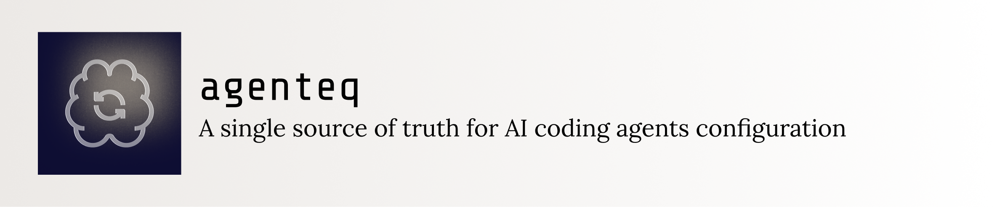
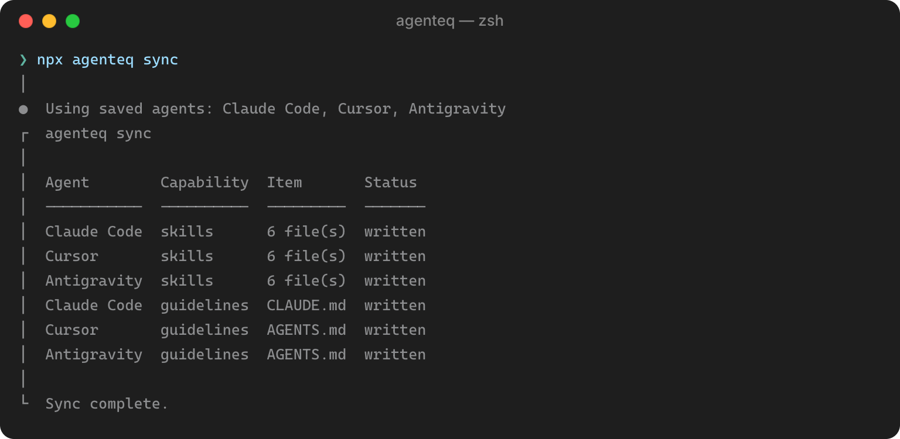

# agenteq



[](https://www.npmjs.com/package/agenteq)
[](https://github.com/sunchayn/agenteq/actions)
[](https://nodejs.org)
[](LICENSE)
[](https://codecov.io/gh/sunchayn/agenteq)

[Getting started](#getting-started) • [Migrating an existing repo](#migrating-an-existing-repo) • [Usage](#usage) • [Supported agents](#supported-agents)

**A single source of truth for AI coding agents configuration.**<br />
Agenteq reads guidelines, MCP servers, skills, and commands from one centralized folder, detects installed agents, and generate each relevant artifact in the path/format the agent expects.
It lets you configure everything once, regardless of which agents your collaborators use, and keeps the generated files out of the repo.



## Getting started

Add this layout to your repository:

```
.ai/GUIDELINES.md           # one agent-agnostic guidelines/rules document
.ai/mcp/<name>/config.json  # one file per MCP server (see MCP config below)
.ai/commands/**             # slash commands, synced verbatim per agent
.ai/skills/**               # skills, synced verbatim per agent
```

> [!NOTE]
> The `.ai/GUIDELINES.md` holds the rules you want every agent to follow. `agenteq` writes a copy for each agent, in that agent's own format and location, for example `AGENTS.md` or `CLAUDE.md`.

Once the files are in place, run this.

```bash
npx agenteq init
```

This looks at your machine and project, finds which agents are installed, lets you confirm or change the list, and generates the first set of artifacts for each agent.

See [`examples/basic`](/examples/basic) for a basic configuration example.

## Migrating an existing repo

If your repo already has scattered per-agent config, a `CLAUDE.md`, a `.cursor/` folder, an `AGENTS.md`, etc. you don't need to copy that content into `.ai/` by hand.  Agenteq ships a skill for that. It will reconcile the scattered files into one source of truth and untrack everything that is not needed anymore.

Install it as a coding agent skill:

```bash
npx skills add https://github.com/sunchayn/agenteq/tree/base/.ai/skills/refactor-to-agenteq
```

Then invoke it via `/refactor-to-agenteq`.

See [`examples/refactor-demo`](/examples/refactor-demo) for a repo with `.claude/` and `.cursor/` fully tracked and no `.ai/` yet, to try the skill against.

## Usage

`agenteq` syncs four capabilities. These are guidelines, MCP servers, skills, and commands.

The following commands are available.

```bash
npx agenteq detect
npx agenteq init
npx agenteq sync
```

### `agenteq detect`

Shows which agents are installed on this system or in this project right now, and which capabilities each one supports.

| Flag     | What it does                                                          |
| -------- | --------------------------------------------------------------------- |
| `--json` | Print the result as JSON instead of a table, so a script can read it. |

### `agenteq init`

Lets you pick which agents to use, saves that choice, and generates the artifacts for the first time. Agents already detected as installed are pre-checked in the picker, but you can add or remove any of them.

Run `init` again to change your selection.

### `agenteq sync`

Generate the artifacts for the agents you already configured.

The first time you run it, with nothing configured, it behaves like `agenteq init`. After that, it picks agents in this order:

1. If you pass `--agents`, sync uses exactly those agents, and saves that choice for next time, the same as `init` would.
2. Otherwise, if you already ran `init` or `sync` before, `sync` reuses the agent list you chose last time. It does not re-scan your system or ask you anything.
3. Otherwise, `sync` scans your system and project for installed agents. If it finds any, it saves that list for next time and uses it.
4. Otherwise, `sync` found nothing and there is no saved list yet, so it falls back to the `init` flow.

> [!TIP]
> You can add `agenteq sync` to a git hook, running it whenever changes to the `.ai` folder are detected.

### Options shared by `init` and `sync`

| Flag                                      | What it does                                                                                                                                                                                                                   |
| ----------------------------------------- | ------------------------------------------------------------------------------------------------------------------------------------------------------------------------------------------------------------------------------ |
| `--agents <a,b>`                          | Skip the picker and use exactly these agents, for example `--agents claude_code,cursor`.<br />Run `agenteq detect` for the exact agent names. Passing it to either `init` or `sync` saves this list as your new configuration. |
| `--only <mcp,commands,skills,guidelines>` | Sync only some of the four capabilities instead of all of them, for example `--only guidelines,skills`.                                                                                                                        |
| `--yes`                                   | Run without prompts.<br />If `agenteq` cannot determine what to do automatically, it fails with an error instead.                                                                                                              |
| `--json`                                  | Print the result as JSON instead of a table.<br />This only changes the output format. At a real terminal, the picker still shows unless `--yes` is also passed.                                                               |
| `--source-dir <dir>`                      | The canonical source folder. Defaults to `.ai`. Change this if you keep it elsewhere in your repo.                                                                                                                             |

Each flag above also has an environment variable equivalent, useful for setting it once in CI. They are `AGENTEQ_AGENTS`, `AGENTEQ_ONLY`, `AGENTEQ_YES`, `AGENTEQ_JSON`, and `AGENTEQ_SOURCE_DIR`. A CLI flag always overrides its matching environment variable.

The saved choice is stored at `<source-dir>/agenteq.json`. It is per developer and per machine, not shared through git. The first time `agenteq` generates it, it also adds the path to `.gitignore`.

> [!TIP]
> In CI, if no agents are configured, no file is saved, and `--agents` is not set, `sync` fails immediately with an error instead. Passing `--agents`, or setting `AGENTEQ_AGENTS`, avoids this.<br />CI is detected automatically, and you can also force this same non-interactive behavior with `--yes` or `--json`.

### Global option

| Flag      | What it does                                                                                         |
| --------- | ---------------------------------------------------------------------------------------------------- |
| `--debug` | Print the full error stack trace to stderr if a command fails unexpectedly. Same as `DEBUG=agenteq`. |

### Error codes

If a command fails, the error message starts with a code in parentheses, for example `(E_UNKNOWN_AGENT) Unknown agent "foo".`. Search this table for that code to see what it means.

| Code                   | What it means                                                                                                                      |
| ---------------------- | ---------------------------------------------------------------------------------------------------------------------------------- |
| `E_UNKNOWN_AGENT`      | An agent name you passed, for example to `--agents`, does not match any supported agent. Run `agenteq detect` for the exact names. |
| `E_UNKNOWN_CAPABILITY` | A capability name you passed to `--only` does not match one of `mcp`, `commands`, `skills`, `guidelines`.                          |
| `E_INVALID_MCP_CONFIG` | A file under `.ai/mcp/<name>/config.json` is not valid JSON, or does not match the shape described below.                          |

### MCP config

Each `.ai/mcp/<name>/config.json` file describes one MCP server. It has a `key` naming it, a `type`, and a `config` object shaped by that type.

> [!TIP]
> You can point `$schema` at the schema shipped with this package to get validation and autocomplete in your editor.

```json
{
    "$schema": "https://unpkg.com/agenteq/dist/schema/mcp-config.schema.json",
    "key": "example-server",
    "type": "http",
    "config": {
        "url": "https://example.com/mcp",
        "headers": { "Authorization": "Bearer ${TOKEN}" }
    }
}
```

| `type`  | `config` fields                            |
| ------- | ------------------------------------------ |
| `stdio` | `command` (required), `args`, `env`, `cwd` |
| `http`  | `url` (required), `headers`                |
| `sse`   | `url` (required), `headers`                |

Any other field you place under `config` is not rejected. It is copied directly into the file each agent writes, so agent-specific or future MCP options work without needing a schema update.

> [!IMPORTANT]
> Junie has no native `http`/`sse` support, so agenteq rewrites those entries into a stdio call to `mcp-remote` instead. `headers` and any other `config` fields are dropped in that conversion.

## Supported agents

Not every agent supports every capability. The table below shows what agenteq can write for each one.

| Agent                                                                                 | Guidelines | Skills | Commands | MCP servers |
| ------------------------------------------------------------------------------------- | ---------- | ------ | -------- | ----------- |
| [Amp](https://ampcode.com)                                                            | Yes        | Yes    | No       | Yes         |
| [Antigravity](https://antigravity.google)                                             | Yes        | Yes    | No       | Yes         |
| [Claude Code](https://claude.com/product/claude-code)                                 | Yes        | Yes    | Yes      | Yes         |
| [Cline](https://cline.bot)                                                            | Yes        | Yes    | No       | No          |
| [Cline CLI](https://cline.bot/cli)                                                    | Yes        | Yes    | No       | No          |
| [Codex CLI](https://github.com/openai/codex)                                          | Yes        | Yes    | No       | Yes         |
| [Cursor](https://cursor.com)                                                          | Yes        | Yes    | Yes      | Yes         |
| [Devin](https://devin.ai)                                                             | Yes        | Yes    | No       | Yes         |
| [Factory Droid](https://factory.ai/product/droids)                                    | Yes        | Yes    | Yes      | Yes         |
| [GitHub Copilot](https://github.com/features/copilot)                                 | Yes        | No     | Yes      | Yes         |
| [GitHub Copilot CLI](https://github.com/features/copilot/cli)                         | Yes        | Yes    | No       | Yes         |
| [GitHub Copilot JetBrains](https://plugins.jetbrains.com/plugin/17718-github-copilot) | Yes        | No     | No       | No          |
| [Goose](https://github.com/block/goose)                                               | Yes        | No     | No       | No          |
| [Grok Build](https://docs.x.ai/build/overview)                                        | Yes        | Yes    | No       | Yes         |
| [Junie](https://www.jetbrains.com/junie/)                                             | Yes        | Yes    | Yes      | Yes         |
| [Kilo Code](https://kilo.ai)                                                          | Yes        | No     | No       | Yes         |
| [Kiro](https://kiro.dev)                                                              | Yes        | Yes    | No       | Yes         |
| [OpenCode](https://opencode.ai)                                                       | Yes        | Yes    | Yes      | Yes         |
| [Pi](https://github.com/earendil-works/pi)                                            | Yes        | Yes    | Yes      | No          |
| [Roo Code](https://github.com/RooCodeInc/Roo-Code)                                    | Yes        | No     | No       | Yes         |
| [Windsurf](https://windsurf.com)                                                      | Yes        | No     | Yes      | No          |
| [Zed](https://zed.dev)                                                                | Yes        | Yes    | No       | Yes         |

A "No" here reflects that agent's own conventions, not a limitation of `agenteq`. For example, Pi has no MCP support of its own, so `agenteq` has nothing to write there.

Detection methods vary by agent. Some rely on a CLI command, others on a project marker files or an install-folder pattern instead. Run `agenteq detect` on your machine to see what is actually installed.

## Contributing

See [CONTRIBUTING.md](CONTRIBUTING.md) for how to set up the project locally, the available npm scripts, and the coding conventions this repo follows.
